# 区块链浏览器

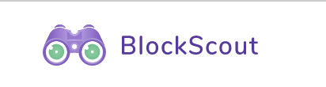

本教程将对区块链浏览器的基本功能进行简单介绍。

操作实验地址为：http://210.22.77.126:10084/

## 区块展示

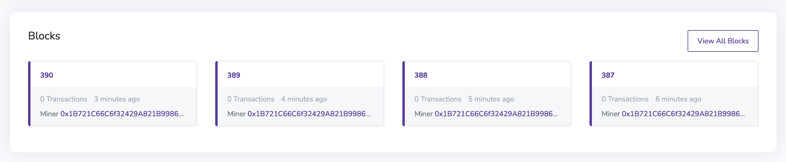

在浏览器页面中，Blocks 模块进行了最新的一组区块展示。

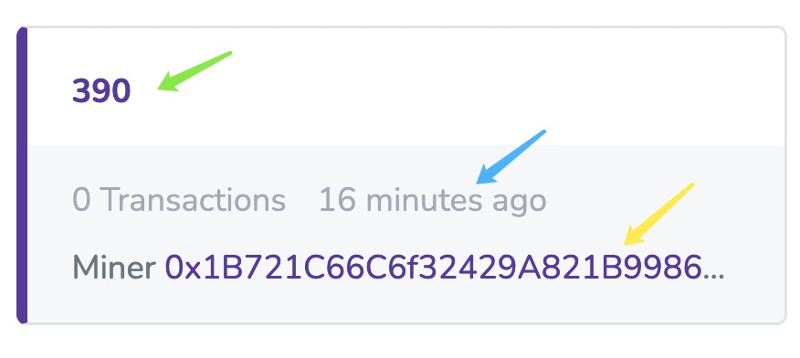

其中，上方的数字代表区块编号（绿色箭头），中间一行表示该区块包含的 Transactions 的个数以及该区块上传的时间（蓝色箭头），最后一行表示 Miner 的地址（黄色箭头）。

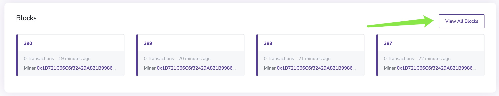

点击 View All Blocks 可以查看所有的区块信息。

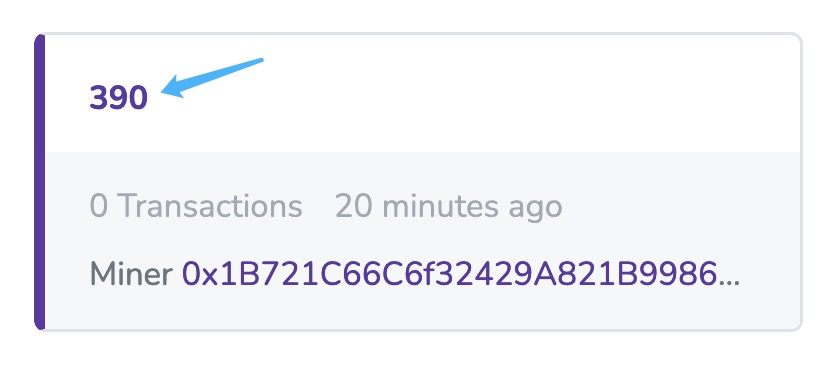

点击某个区块的编号可以查看某个区块的详细信息。

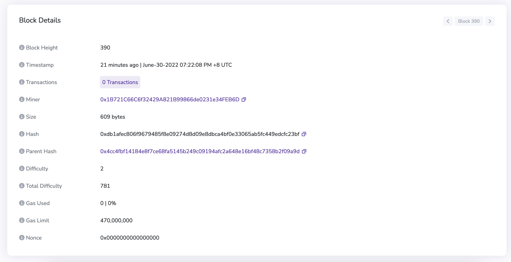

详细信息包含 Block Height，Timestamp，Transactions，Miner，Gas Used等。

## 交易展示

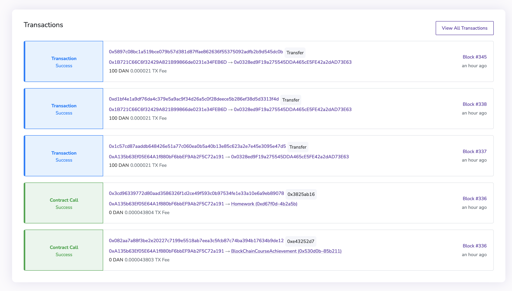

在浏览器页面中，Transactions 模块进行了最新的一批交易展示。

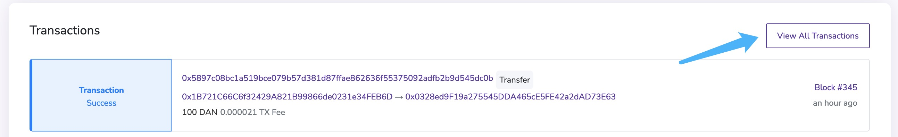

点击 View All Transactions 可以查看所有交易信息。

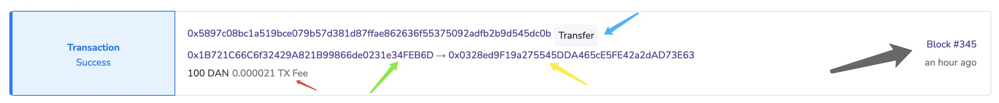

第一行（蓝色箭头）表示交易编号，第二行代表交易流动方向（从绿色地址流向黄色地址），最后一行（红色箭头）代表交易数值，右侧（灰色箭头）表示该交易对应的区块号和该交易的时间。

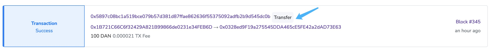

点击交易编号可以查看该条交易的详细信息。

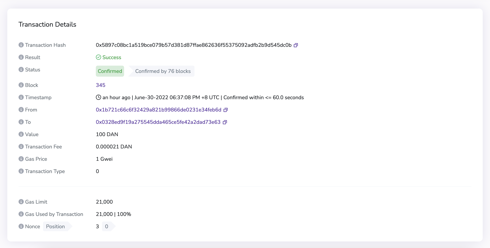

详细信息包含 Transaction Hash，Result，Block，From，To 等。

## 地址展示

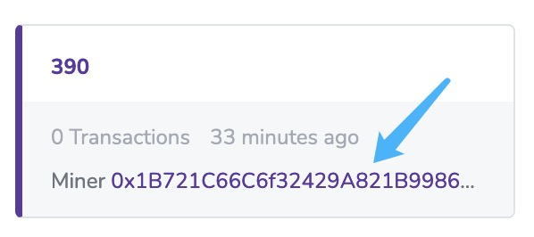

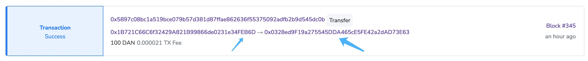

点击 Blocks 中的地址或 Transactions 中的地址均可查看某个地址的详细信息以及该地址的交易列表。

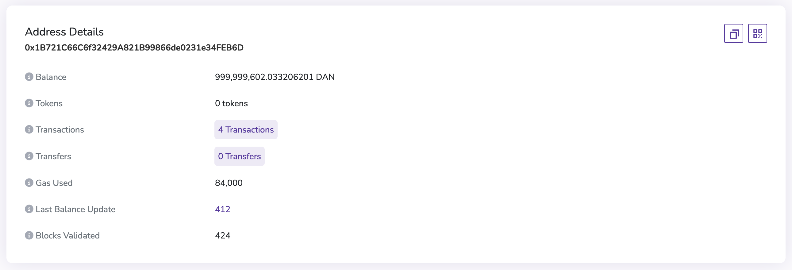

地址的详细信息包含 Balance，Tokens，Transactions 等。

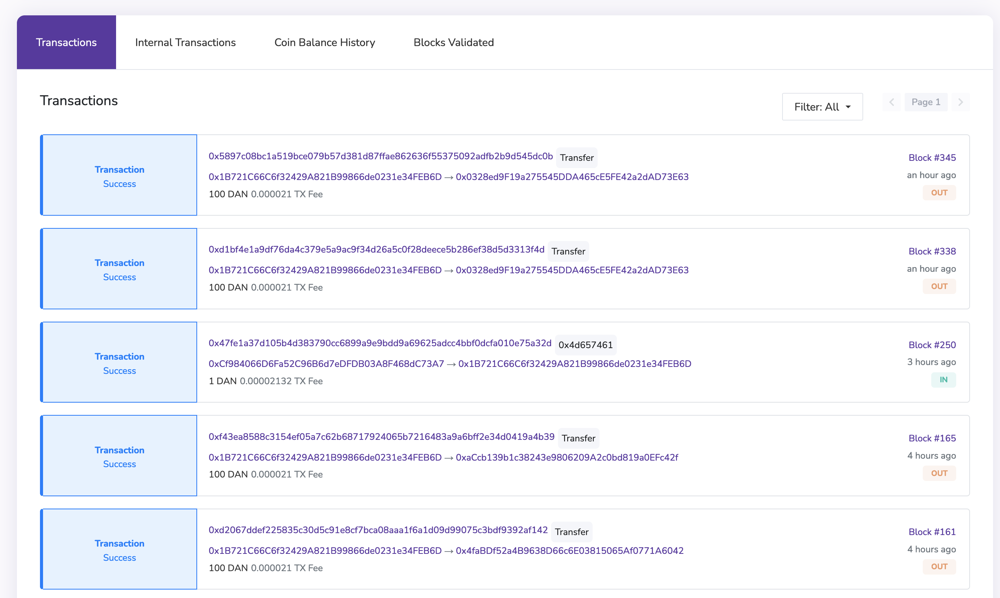

该地址的交易列表位于页面下方，展示了该地址参与过的交易。